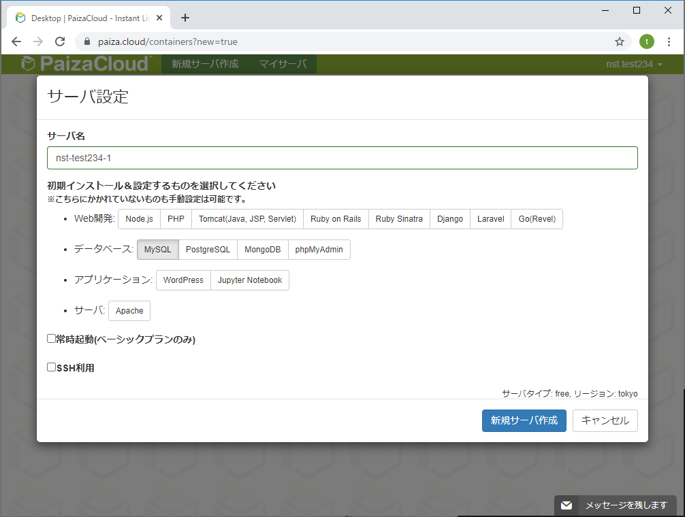

# 3Days 実習用　DBアクセスの最適化

## 事前準備

MySQLをセットしてサーバーを起動する




### Githubからのダウンロード

ターミナルを開いて下記のコマンドを実行する

```
~$ git clone https://github.com/nstshirotays/2020point.git
```

ディレクトリを移動して初期処理を実行する

```sh
~$ cd 2020point
~/2020point$ ./init.sh
Create database
Create tables
finish

```


## テーブル構成

### logdata (販売ログデータ)

商品別、お客様別に付与されたポイントのデータ


| **項目名** | **内容**     | **サンプル** |
| ---------- | ------------ | ------------ |
| product    | 商品番号     | 23           |
| user       | お客様番号   | 120          |
| point      | 付与ポイント | 23           |


### campaign (キャンペーンデータ)

キャンベーン対象となった商品とお客様番号の組


| **項目名** | **内容**     | **サンプル** |
| ---------- | ------------ | ------------ |
| product    | 商品番号     | 23           |
| user       | お客様番号   | 120          |


## 課題

販売ログデータより、キャンペーン対象として付与されたポイントを除くポイント数の合計を求めたい。このため下記のようなクエリを作成した。


```
select  sum(point) from logdata left join campaign on logdata.product = campaign.product and logdata.user = campaign.user where campaign.product is NULL;
```


これを実行すると時間が1分30秒～3分程度かかってしまう。これをなるべく高速に検索したい。

```
~/2020point$ sudo mysql kadaidb

   （中略）

Type 'help;' or '\h' for help. Type '\c' to clear the current input statement.

mysql> select  sum(point) from logdata left join campaign on logdata.product = campaign.product and logdata.user = campaign.user where campaign.product is NULL;

+---------+
| sum(z)  |
+---------+
| 4225462 |
+---------+
1 row in set (1 min 25.70 sec)

mysql>

```


